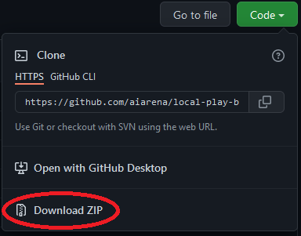

# local-play-bootstrap

## What is this?
This repo intends to be a pain-free method for SC2 AI bot authors to quickly setup and verify that the arena client docker works for running local bot matches on their system.  
This system uses the same docker image that the [SC2 AI Arena ladder](https://sc2ai.net) runs on.

## Prerequisites

This bootstrap requires Docker Compose to run.  

If you've installed Docker on Windows or MacOS then Docker Compose is already installed.  
For other systems: [How to install Docker Compose](https://docs.docker.com/compose/install/)

If you're on Linux and don't wish to install docker compose, refer to the [linux-sun.sh](./linux-run.sh) file for how to trigger running of matches.

## Getting started

### Download this repo

We recommend against cloning this repo unless you intend to contribute changes.

### Validating your setup

A test match between 2 included test bots is preconfigured to run in the `matches` file.

Before running the test match, first:
1. Download the [Sc2 AI Arena 2022 Season 1 maps](https://sc2ai.net/wiki/184/plugin/attachments/download/9/) and place them in your system's StarCraft II maps folder.  
   If you don't have Starcraft II installed, create a maps folder somewhere to place them in.
2. Check that the SC2 Maps Path setting in the docker-compose.yml file correctly points to the folder you placed the maps in.  

Now you can run the test match using `docker-compose up`.

## Running your own matches

1. Put your bots in the `bots` folder.
2. Add the relevant entries for matches you wish to play to the `matches` file.
3. Start the run script to run a match.
4. View results in the `results` file and replays in the `replays` folder.
5. For troubleshooting, check the `logs` folder for bot logs or the `client.log` file.

## Contribute
If you notice issues with setup, or have ideas that might help other bot authors, please feel free to contribute via a pull request.

## License

Copyright (c) 2022

Licensed under the [GPLv3 license](LICENSE).
